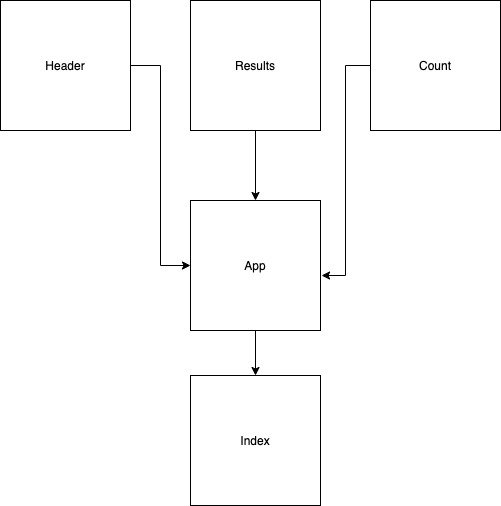

# LAB - 30

## RESTy

### Author: Trevor Thompson

### Links and Resources
* [submission PR](https://github.com/trevorthompson-401-advanced-javascript/RESTy/pull/1)
* [travis](https://travis-ci.com/trevorthompson-401-advanced-javascript/RESTy)
* [Code Sandbox](https://codesandbox.io/s/github/trevorthompson-401-advanced-javascript/RESTy)
* [Netlify](https://eager-allen-d42258.netlify.com/)

### Setup
* `npm install`
* `npm start`
  
#### Tests
* `npm test`

#### UML
